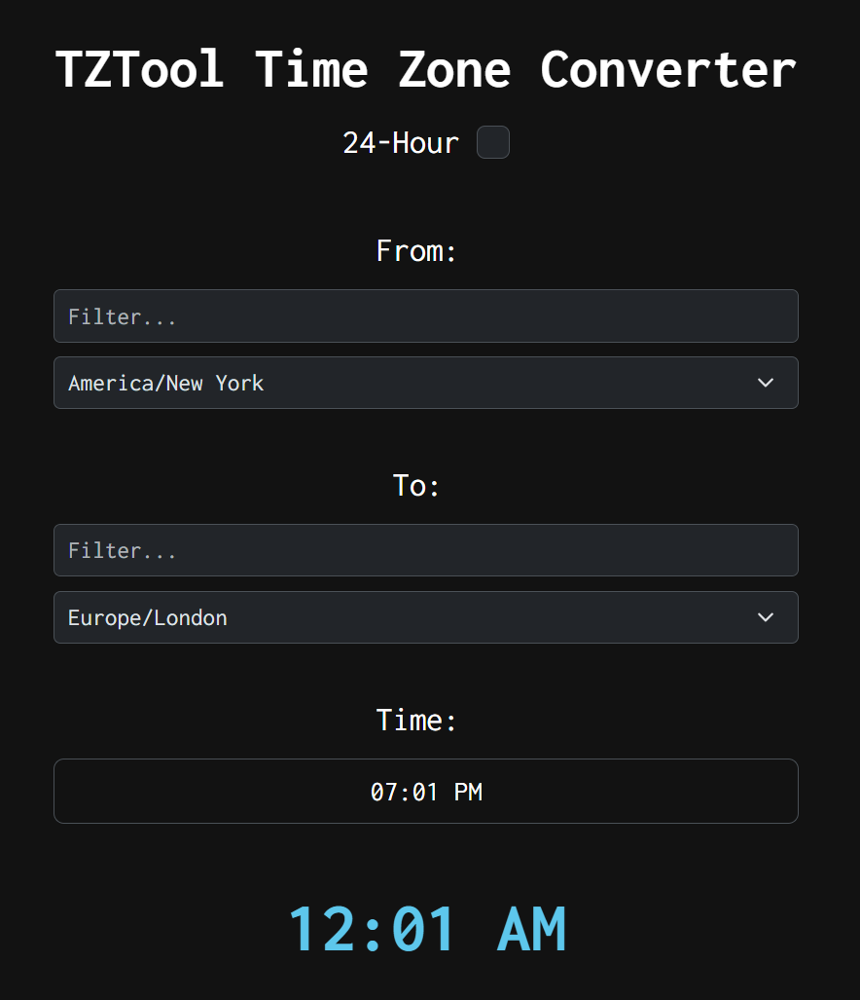

# TZTool: React.js/Next.js-based Time Zone Converter

A small project I chose to build to sharpen skills and for fun.
I opted to use momentjs over dayjs for this project as dayjs's timezone
plugin still needs work. This app converts a time from one timezone to its
corresponding time in another timezone. In practice, timezones are a lot trickier
than at first glance. Though I believe in its current version that I have ironed out
the major stuff and it is in a well working state. If you do encounter anything strange,
feel free to submit a pull request.

# Running it yourself

To run this app:
-   Ensure you have `nodejs` installed. (I used v20.9.0 at time of writing this)
-   Clone the project to your local system.
-   `cd` into the root of the project directory.
-   Run `npm i` to install all dependencies.
-   `npm run dev` to execute the dev environment.
-   The app should now be up at `localhost:3000`

That is all for the local environment. I may deploy this at some point and if so
I will update this README accordingly (if I don't forget :sweat_smile:).

# License
This project is fully open-source under the terms of the BSD-3-Clause license.
Read the LICENSE file for details.